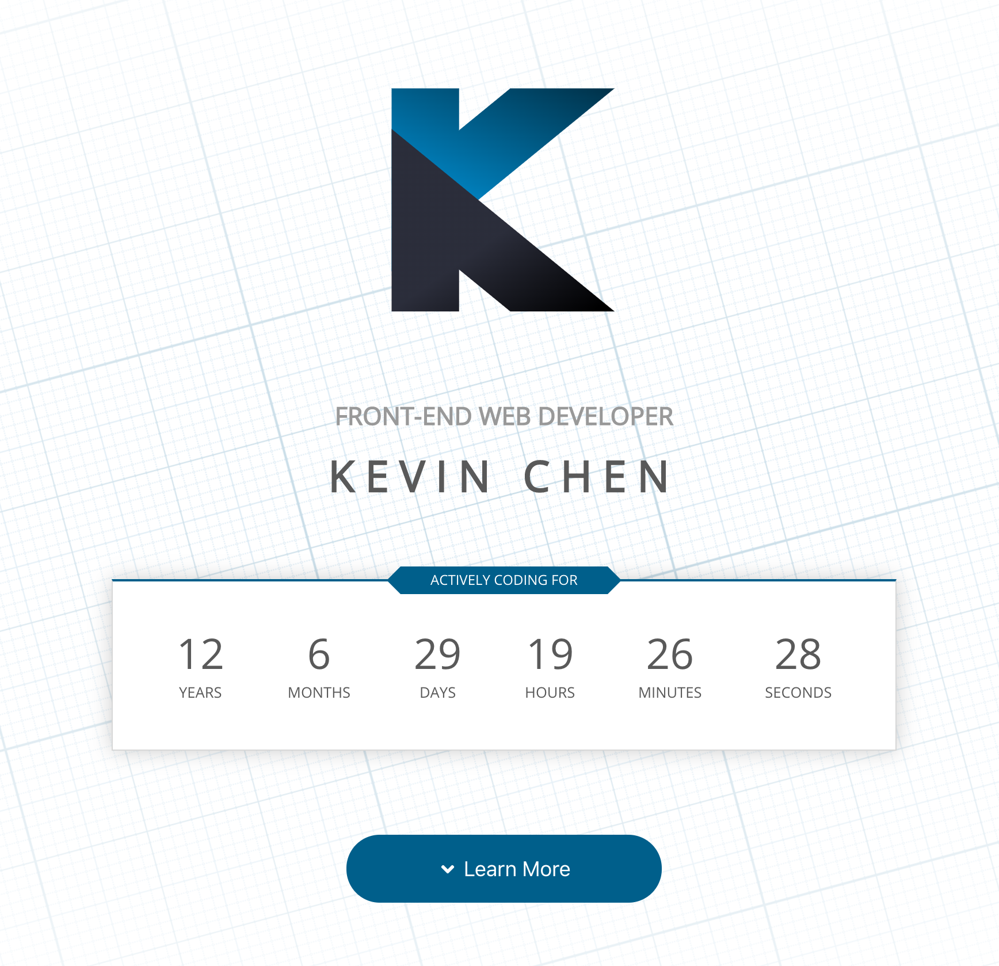

Portfolio
=======

Kevin Chen's personal website showcasing web technology and side projects.

Usage
------------
Access the website by [clicking here](http://k39chen.github.io/portfolio).

This personal website is hosted on Github Pages and can be set up by following [this guide](https://dev.to/yuribenjamin/how-to-deploy-react-app-in-github-pages-2a1f).

Developer Usage
------------
This is using [Create React App](https://github.com/facebook/create-react-app) with minimal modifications. To begin development, perform the following:

- Download source files in this repository
- In your command line, `cd` to the target directory above
- Run: `npm install` to download the required dependencies
- Run `npm start` to start local development server

At this point, you should be able to edit the source code for this website as necessary.

License
-------------
Copyright (c) 2020 Kevin Chen.
